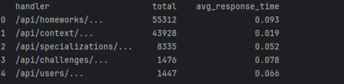

### Установка
```
git clone https://github.com/OrneysOriginal/test-task.git
cd test-task
```

### Установите зависимости
```
pip install -r requirements.txt
```

### Использование
```
python src/main.py --file <лог-файлы> --report <тип отчета>
```

### Пример вывода
